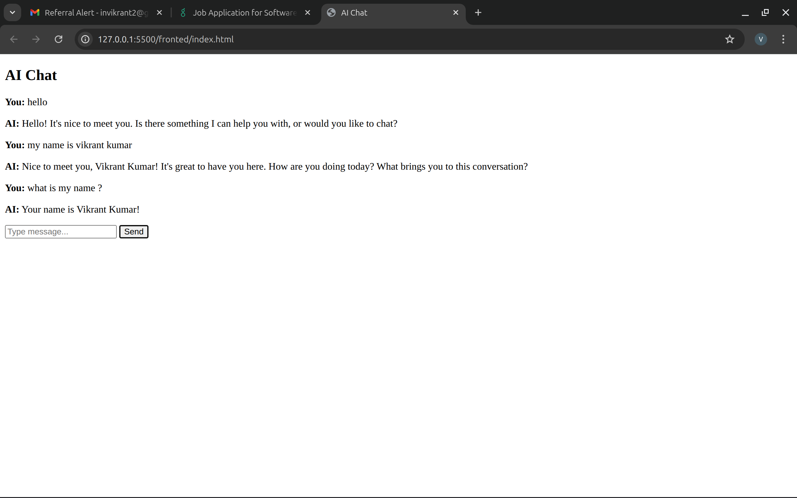

# cf_ai_chat_app

## Overview
Simple AI chat app with memory using Cloudflare Workers AI.

## Features
- Chat interface
- Uses Llama 3.3 (Workers AI)
- Stores conversation using KV (memory)

## Setup

### Install Wrangler
npm install -g wrangler

### Login
wrangler login

### Setup KV
wrangler kv:namespace create CHAT_MEMORY

### Update wrangler.toml with KV ID

### Run Worker
cd worker
wrangler dev

### Open frontend
Open frontend/index.html in browser

## Usage
- Type message
- AI responds
- It remembers conversation# cf_ai_chat_app

## 📸 Screenshots

### Chat Working

